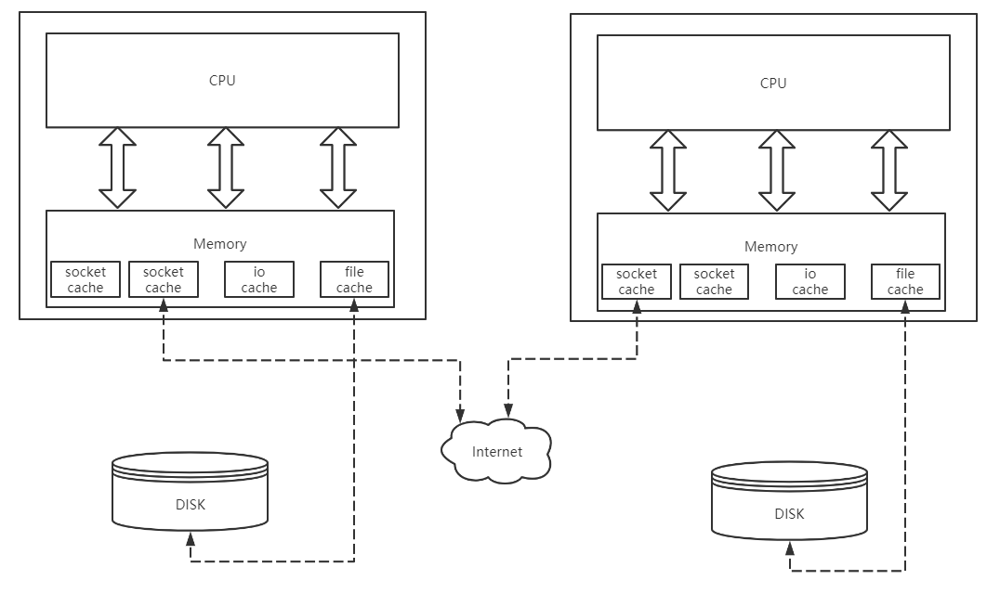

[TOC]

## chapter01 理解网络编程和套接字

### Basic

q:本章的是如何组织的?
1.1. 理解网络和编程套接字
1.2. 基于Linux的文件操作
1.3. 基于Windows平台的实现
1.4. 基于Windows的套接字

q:这么组织的原因?
>首先引出socket，然后引入文件操作。对于linux而言，操作socket本质上操作file，所以需要了解文件操作。
网络数据的收发，在linux下本质是文件的读写。
所以，归根结底，看似丰富的网络应用到最底层其实调用的read/write系列函数。
最后，对比了windows的设计，因为windows的设计区别socket handle/file handle，这里代理的代价就是需要提供不同的操作接口

q:深入理解所有设备都是文件?
1. 这里说的设备，指的都是io设备
2. 他们的操作方式都一样，都采用文件操作进行。
3. 对于os接口而言，无论读写，进行的操作都是一样的，即把数据写入缓存/读入缓存。(注意，所有io操作，都遵循这个方式)
4. 以写数据为例，cpu把数据写入socket/file cache，对于os api来说工作完成。剩下的工作由设备控制器(网卡控制器，磁盘控制器)进行，具体来说网络就是根据ip协议找到对端的机器，将数据写入对端的输入缓冲区。对端的os api会从输入缓冲区读取。对于磁盘来说，则由磁盘控制器，将数据落地到具体的盘块。
5. 读数据是一样的道理。os api只关心缓冲区的内容，有就读。至于数据是怎么来的，则由设备控制器完成。至于os api怎么知道，这里应该有(不确定)类似的通知机制，在设备控制器完成数据的写入后，通知cpu可以进行读取，cpu则会从缓冲区读取数据




q:sokcet作用是什么?为什么叫socket?
1. os提供的网络编程句柄，一个socket关联了一条网络链路，具体来说要对应一个内存cache
2. socket本意插槽，插头插入即可获得电力。类似的，只要通过socket，即可获得网络传输的能力

q:bind vs listen vs accept?
1. bind: 为socket绑定一个host，host对于client不重要，但是server重要，否则客户端不知道请求谁
2. listen: 让socket处于监听状态(什么是监听状态，暂时不纠结)，即客户端可以发起请求
3. accept: 受理一个请求，创建clnt_sock，可以进行实际的网络通信


### 实践

- demo-01

一个基础的客户端-服务器模式的server，尚未实现echo功能

- 内存泄露
```c
  while(1) {
    printf("[%s:%s] listening...\n", argv[1], argv[2]);

    int clnt_sfd = accept(serv_sfd, (struct sockaddr*) &clnt_addr, &clnt_addr_sz);
    if(clnt_sfd == -1) {
      perr_handling("accept", "error");
    }
    printf("[%s:%u] connected!\n", inet_ntoa(clnt_addr.sin_addr), clnt_addr.sin_port);

    // send message to client
    const char message[] = "hello,world!";
    write(clnt_sfd, &message, sizeof(message));

    // 这里特别小心，一旦丢失socket的句柄，对应资源会发生泄露。
    // 进程如果挂了，并没事，进程结束资源会回收。
    // 如果在while loop里面，则会出泄露
    close(clnt_sfd);
    printf("[%s:%u] disonnected!\n", inet_ntoa(clnt_addr.sin_addr), clnt_addr.sin_port);
  }
```

- demo-02

q:什么是底层?
>通俗来说，越接近硬件，越底层。当我们在网络编程谈起底层时，我们是说与标准无关的、操作系统独立提供的。
eg: Linux提供的文件IO函数，就非ANSI提供。

