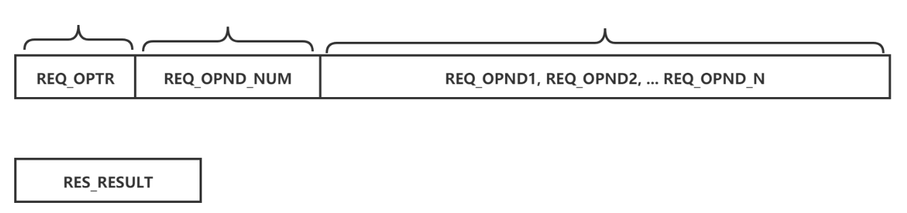

## chapter05 基于TCP的服务器端/客户端(2)

### Basic

q:本章是如何组织的?
5.1.回声客户端的完美实现
5.2.TCP原理
5.3.基于Windows的实现

q:目前实现的echo server有什么问题?
>我们分别看下server side和client side实现
以上的实现都具有一个显著特点就是:read只调用一次,那么这回导致什么问题呢?
1. 我们在transport layer是基于tcp协议开发的,tcp传输特性是数据没有边界
2. 考虑client发送的数据,包体太大,内核需要填充两次send buffer.但是此时server的read函数,有数据就返回,那么server端会丢掉客户端发送的第二次数据
3. 对于server发送的数据,客户端存在同样的问题.
4. 既然tcp协议的传输特性是没有数据边界,那么在进行数据传输时,需要制定传输数据的大小.

```cpp
// server
void do_io_event(int clnt_sfd) {
  char buf[BUF_SZ];

  int nread = read(clnt_sfd, buf, BUF_SZ);
  write(clnt_sfd, buf, nread);
}

// client
void do_io_event(int clnt_sfd) {
  const char* msg = "hello, echo server, i am echo client.";
  char buf[BUF_SZ];

  write(clnt_sfd, msg, strlen(msg));
  int nread = read(clnt_sfd, buf, sizeof(buf));
  buf[nread] = '\0';
  std::cout << buf << std::endl;
}
```

q:如何改进?
1. 对于server side,没必要按照数据大小来获取,server一直获取数据,直到client读取完全部数据,断开socket.此时server read eof,结束获取即可
2. 对于client side,那么必须要按照数据大小获取数据.发送了多少数据,必须接受多少数据.

```cpp
// server
void do_io_event(int clnt_sfd) {
  char buf[BUF_SZ];
  int nread = 0;

  while((nread = read(clnt_sfd, buf, BUF_SZ))) {
    write(clnt_sfd, buf, nread);
  }
}

// client
void do_io_event(int clnt_sfd) {
  const char* msg = "hello, echo server, i am echo client.";
  char buf[BUF_SZ];
  int str_len = strlen(msg);

  write(clnt_sfd, msg, str_len);
  read_n(clnt_sfd, buf, str_len);
  buf[str_len] = '\0';
  std::cout << buf << std::endl;
}

void read_n(int fd, char buf[], int n) {
  int total = 0;
  int nread = 0;
  while(total < n) {
    nread = read(fd, buf+total, BUF_SZ);
    if (nread == -1) {
      if (errno == EINTR)
        nread = 0;
      else
        return;
    }
    else if (nread == 0)
      break;

    total += nread;
  }
}
```

q:对于echo server目前的解决方案,有什么问题?
>对于这个case,我们可以知道client发送的数据大小,如果要是不能直接获取,怎么办?

**结论:如果问题不在回声客户端,定义应用层协议**

q:为什么要定义应用层协议?
>从上面的例子中,我们可以看出来,对于数据收发边界这一类问题,不是传输层能解决的,因为这个问题和业务强耦合.
不同的业务有各自不同的选择,所以,设计应用层协议的目的就在此.针对特定应用,制定的数据传输规则集合,就叫做应用层协议。
其实，整个tcp协议栈就是解决好网络数据传输这么一件事情。

q:协议以什么样的形式体现？
1. 规则集合
2. 对于协议双方透明，且双方都需要遵守哦。

接下来，我们看一个实际的问题，从中体会定义应用层协议的过程。切记，应用层协议不是高深莫测的存在，只不过是针对特定应用，定义的数据传输规则。

q:实现一个如下计算器，直接给出操作界面，根据此实现这个服务？
>client side:
operand count: 3
operand 1: 12
operand 2: 13
operand 3: 11
operator: -
operation result: -12

此时，客户端无法向echo client那样，知道自己发送多少数据，相应的，会接受多少数据。所以，此时需要更为详细的应用层协议来定义数据传输规则。

q:如何定义应用层协议？
>根据我们前面的总结，关键是把数据边界描述清楚。尤其是对于接收端，要接受多少个字节的数据，需要定义清楚
1. 对于client，发送多少字节数据，这个信息怎么让server知道
2. 对于server，发送多少字节数据，这个信息怎么让client知道

**下面给出本次的协议：**
1. client发送数据协议，第1个字节操作符，第2-5个字节操作数数量。第6-n个字节存放操作数。
2. server发送数据协议，第1-4个字节存放结果。



代码协议如下：
```cpp
#ifndef CAL_PROTOCOL_H_
#define CAL_PROTOCOL_H_

// Request protocol
#define REQ_OPND_NUM_SZ 4
#define REQ_OPND_SZ     4
#define REQ_OPTR_SZ     1

// Response protocol
#define RES_RESULT_SZ   4

#endif
```
- 对于server，先读取REQ_OPTR_SZ + REQ_OPND_NUM_SZ获取optr and opnd_num。解析出opnd_num，进行opnd_num轮读取，每次读取REQ_OPND_SZ个字节
- 对于client，读取RES_RESULT_SZ个字节即可。

q:实践过程中的问题？
1. 为什么直接利用buf发送，不用考虑字节序，大端小端的问题
2. io_read_n实现错误
3. dynamic array的选择
>对于第一个问题，这么考虑，即使序列化方法，最后还是只能用read/write这些方法进行网络io，所以总得用不需要序列化的读取/写入方法。这个方法就是直接进行字节流的传输。
本次的实现，我就是对于buf填充数据，直接进行字节流传输
>对于第二个问题，因为io_read_n实现的时候，具体调用read每次还是读取BUF_SZ,这和第三个参数矛盾了。比如，缓冲中有100byte数据，读取三次，30/30/40这么读取。
但是第一次读取的时候，直接读取了BUF_SZ，直接导致tcp recv buffer被读取完毕，再进行第二个读取的时候，触发阻塞条件。
>对于第三个方法，本身我在纠结用malloc/free 还是 new/delete，后来想，既然c++用了，合理的特性为什么不用。
尝试直接使用shared_ptr,后来查阅写cpp-primer,Best practices: Most applications should use a library container rather than dynamically allocated arrays. Using a container is easier, less likely to contain memorymanagement bugs, and is likely to give better performance. 
顿悟，采用vector解决

```cpp
void io_read_n(int fd, char buf[], int n) {
  int total = 0;
  while(total < n) {
    int nread = read(fd, buf+total, n - total);
    if (nread == -1) {
      if (errno == EINTR)
        nread = 0;
      else
        return;
    }
    else if (nread == 0)
      break;

    total += nread;
  }
}
```

### 实践

- demo-01

这个demo解决上一章echo server实现没有考虑tcp传输特性的问题, read_n函数的实现要小心,buf每次需要更新读取首地址.

- demo-01-old

老版本纯c的实现

- demo-02

目前保持这样的规范
1. 使用g++进行编译
2. 使用gtest/gflags，暂时不用glog
3. dynamic memory使用c++特性
4. io使用c特性，禁用c++特性

- demo-02-old

支持zlog

- demo-03

- 测试zlog文件转档

zlog根据时间戳就行文件转档确实很方便


- demo-04

q:为什么发送结构体，不是好的数据通信方式？好的数据通信方式又有哪些标准？
>先说好的数据通信方式：可扩展，跨语言，跨平台
结构体之所以不是好的数据通信方式，从这3个点说就好。跨语言？显然结构体不夸语言。跨平台？cpu体系结构不一致，同一个类型的数据，所占字节不一致，内存对其方式也不一致。
可扩展？不方便实现，比如本次的需求，传递多个opnd，可能需要每次都改struct 结构。但是pb repeated field就能很好的解决这个问题.

q:cstdio and stdio.h的选择?
>采用陈硕的建议，除了cpp标准库，其余都采用.h的形式
需要特别注意的是，c兼容的库，要注意变量是否在std中，我看到的应该都是在全局命名空间中

- demo-05/demo-05-a

本小节采用pb实现，避免上文提到的struct 作为data interchange format的问题。
本质上来说，data interchage format显然是应用从层的协议

虽然解决了data interchange format的问题，但是又带来了另外的两个问题
- tcp socket没有数据边界，如何标示数据的首尾
- pb序列化接口非常多，该用哪个

q:echo server在client端和server端的实现，保证了收发数据的完整，为什么本节的demo不行?
>回归echo server，client端作为发起数据的一方，知道字节发送数据的大小。所以，在read时，实现成Read保证需要字节的读取完成。
server端根本不在乎数据的开始和结尾，read有数据就write，毕竟完整的数据在client端可以控制。
但是，这个小节的问题在于，server端需要收到完整的数据，要进行进一步的逻辑。
>
>一个显然的办法是，在发送业务数据前，先发送该数据的大小，让server端按照这个大小进行对于业务数据的获取。
但是，这回带来一个问题是，业务数据的大小，server端怎么能保证接受完整。所以，可以发送这个业务数据大小的大小。显然，这陷入了一个死循环过程中。
>
>这个问题，我们也留到后面去看怎么解决。所以，本小节我在实现的时候，就没有考虑数据收发的完整，更多的是学到对于pb这种data interchange format的使用

q:pb序列化接口这么多，应该怎么使用?

- ParseFromArray/SerializeToArray

```cpp
void do_io_event(int clnt_sfd) {
  // recv from client
  char buf[BUF_SZ];
  ssize_t nread = read(clnt_sfd, buf, BUF_SZ);

  cal::CalRequest req;
  req.ParseFromArray(buf, nread);

  if(!req.has_seqno() || !req.has_left() || !req.has_right() || !req.has_optr()) {
    fprintf(stderr, "%s\n", "Invalid CalRequest.");
    return;
  }

  // do caculation
  cal::CalResponse res;
  do_cal(req, &res);

  // send to client
  int sz = res.ByteSize();
  res.SerializeToArray(buf, sz);

  write(clnt_sfd, buf, sz);
}
```

```cpp
bool	
ParseFromArray(const void * data, int size)
//Parse a protocol buffer contained in an array of bytes.

bool	
SerializeToArray(void * data, int size) const
//Serialize the message and store it in the given byte array.
```

通过这个demo，我看可以看出。```SerializeToArray```这个接口的使用，buf和sz都没有什么问题。```ParseFromArray```这个接口的问题在于，sz如何确定，还是需要知道

- ParseFromString/SerializeToString
```cpp
bool SerializeToString(string* output) const 
// serializes the message and stores the bytes in the given string. Note that the bytes are binary, not text; we only use the string class as a convenient container.
// 这点特别要注意，不是unp当中提到的text strings，就是binary bytes，不是character bytes.即前者不具有可解释性
bool ParseFromString(const string& data);
// parses a message from the given string.
```

```cpp
void do_io_event(int clnt_sfd) {
  // recv from client
  char buf[BUF_SZ];
  ssize_t nread = read(clnt_sfd, buf, BUF_SZ);

  cal::CalRequest req;
  std::string recv_buf(buf, nread);
  req.ParseFromString(recv_buf);

  if(!req.has_seqno() || !req.has_left() || !req.has_right() || !req.has_optr()) {
    fprintf(stderr, "%s\n", "Invalid CalRequest.");
    return;
  }

  // do caculation
  cal::CalResponse res;
  do_cal(req, &res);

  // send to client
  std::string send_buf;
  res.SerializeToString(&send_buf);

  write(clnt_sfd, send_buf.data(), send_buf.size());
}
```

对于这两个接口，注意如下：
1.SerializeToString没什么说的，write时，注意是send_buf.data()，之前一直写的是send_buf.c_str(). 通过c_str()我们知道，这个方法，返回的是包括null-terminated sequence of characters.
通过上面的接口，我们知道，string做的只是一个convenient container，是binary bytes.
data：returns a pointer to the first character of a string 
c_str：returns a non-modifiable standard C character array version of the string 

2.ParseFromString这个接口，虽然是对string进行反序列化，但是string的构造要注意，不能直接通过buf，否则会截断


[ParseFromString function of protobuf returns false](https://stackoverflow.com/questions/51805951/parsefromstring-function-of-protobuf-returns-false)
[Serialize C++ object to send via sockets to Python - best approach?](https://stackoverflow.com/questions/23785155/serialize-c-object-to-send-via-sockets-to-python-best-approach)
[protobuf进行ParseFromString解包失败的一个常见问题](https://blog.csdn.net/dreamvyps/article/details/30070877)
