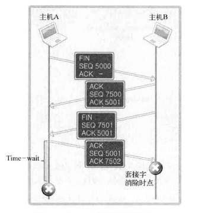
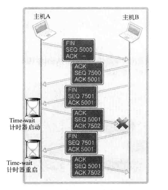

## chapter09 套接字的多种可选项

### Basic

q:本章是如何组织的？
9.1 套接字可选项和I/O缓冲大小
9.2 SO_REUSEADDR
9.3 TCP_NODELAY
9.4 基于Windows的实现

q:套接字选项是如何组织的？
>套接字选项也是按照层次来组织的。
SOL_SOCKET是通用可选项
IPPROTO_SOCKET是TCP协议相关事项
IPPROTO_IP是IP协议相关事项

q:套接字选项API？
```cpp
#include <sys/socket.h>

int getsockopt(int sock, int level, int optname, void* optval, socklen_t* optlen);

int setsockopt(int sock, int level, int optname, const void* optval, socklen_t optlen);
```

q:如何修改套接字的缓冲？
1. SO_SNDBUF/SO_RCVBUF
2. 当应用程序设置缓冲时，内核不会严格按照我们的要求来进行，所以实际设置的大小，和我们的诉求，有出入(显然，如何设置发送缓冲为0，tcp协议将无法实现流控，内核不会同意)

q:如何理解TIME_WAIT?
>TIME_WAIT是tcp状态转换当中的一个比较重要的状态，这里相信只是应该求助于unp的内容。这里我先做简单总结：
1. 时机？TIME_WAIT出现在断开连接，四次挥手的时候。
2. why?
2.1. 如下图，主机B发送FIN消息之后，主机A会发送ACK。但此时如果主机A发送的ACK丢失，那么主机B会重新发送FIN，但此时主机A已经结束。那么主机B无法接受到主机A的ACK，当重试一定次数后，主机B异常结束。
2.2. 如果主机A引入TIME_WAIT，那么上述情况发生时，还可以向主机B发送ACK应答，从而保证对端可以正常结束。
2.3. 需要注意的是，如果主机B继续发送FIN，虽然如2.2中描述，主机A会再次回答ACK，但是此时也会重启TIME_WAIT，这个状态会持续一段时间。
3. 只有服务端会TIME_WAIT?不对。客户端和服务端都会经历time_wait，先断开的一定会经历time_wait。只不过，client由于每次的端口随机，所以不用在乎这件事。但是server由于端口固定，经历time_wait会让服务端无法迅速重启。




q:什么是nagle算法？
>简单来说，只有当收到前一数据的ACK时，nagle算法才发送下一次数据

q:nagle算法的优点是什么？
>最大限度的进行缓冲，减少网络当中的包体，提高传输效率
>如果频繁的发送小包数据(包体较小，但是包头很大)，会增加网络流量
不如，对包体进行缓冲，发送时只附加一个包头，这样会减少网络流量，每次发送的包体占比高很多。

q:nagle算法的缺点是什么？
>nagle最大限度的进行缓冲，很明显会降低传输速度，因为传输的次数变少了。

q:nagle的适用场景是什么？
>小包传输的场景适合nagle。这里会最大限度的进行缓冲。
但是对于大文件，则不适合用nagle。因为对于大文件，从用户态拷贝到内核态缓冲不会花太多时间，所以不使用nagle算法，也能保证在发送前装满输出缓冲。
此时，不用收到上一个ack就发送数据，显著提高传输速度。

### 实践

- demo-01

对socket进行设置SO_REUSEADDR